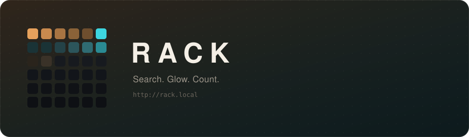
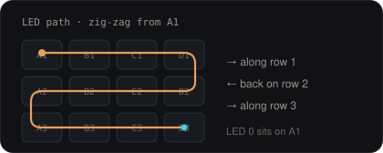

<p align="center">
  
</p>

<p align="center">
  <a href="http://rack.local"><code>rack.local</code></a>
  ·
  <a href="docs/API.md">API</a>
  ·
  <a href="https://github.com/neooriginal/ElectronicRack/releases/latest">latest build</a>
</p>

Search “10k” or “flux” on your phone. If it’s in the rack, that bin lights up. Tap **+** when you put some in, **−** when you take some out.

The page is served by the ESP32. Nothing else to host.

---

### What you need

| | What |
| --- | --- |
| Board | ESP32 DevKit |
| Lights | One WS2812-style LED per bin, data on **GPIO 13** |
| Power | Shared ground, and a real **5 V** rail — USB will fold under a full strip |

Default layout is **6×6**. Setup can grow it.

<p align="center">
  
</p>

---

### Flash once

```bash
cp include/secrets.example.h include/secrets.h   # your Wi-Fi
pio run -t upload && pio run -t uploadfs
```

Then open **http://rack.local**. If the network isn’t there, the board raises an open AP named `RACK-…`.

After this USB flash, new firmware comes from **Setup → Firmware**.

---

### First evening

1. **Setup → Use zig-zag from A1 → Light corners**  
   A1 red · far top green · far left blue · opposite white. Match that, you’re calibrated.
2. **Walk bins** if you want the slow tour.
3. Search something you actually own. Tap **+**. Put it in the glowing hole.

Rows, brightness, animations — change them whenever. It saves itself.

---

### After that

More drawers? Raise rows, columns, and LED count. Old stock keeps its names.

Every push to `main` publishes a GitHub `latest` release. The rack notices.

Scripts talk to it too — [docs/API.md](docs/API.md), also at `http://rack.local/api.md`.

```bash
curl http://rack.local/api/find?q=10k
curl http://rack.local/api/locate?cell=A3
curl 'http://rack.local/api/add?cell=A3&n=5'
```
